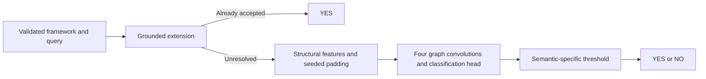

# AFGCN: Neural Approximation for Abstract Argumentation

[](https://github.com/lmlearning/AFGCN/actions/workflows/tests.yml)

**Answer argument-acceptance queries with grounded reasoning and a graph convolutional network.** AFGCN combines structural node features, residual graph convolutions and semantic-specific thresholds to approximate credulous and skeptical decision problems.

Research lineage: the AFGCN approach won four of six approximate-track categories at ICCMA 2021. See the [official results](https://argumentationcompetition.org/2021/downloads/iccma_results_ijcai.pdf) and the [research paper](https://www-users.york.ac.uk/peter.nightingale/aij-argumentation-2024.pdf) by Lars Malmqvist, Tangming Yuan and Peter Nightingale. The current smoke tests establish execution correctness, not a rerun of the competition.

## Run the included example

Use Python 3.11 in an activated virtual environment, from the repository root. The pinned environment supports CPU execution on Linux and Windows.

```bash
python -m pip install -r requirements-cpu.txt pytest
python Solver/solver.py --filepath Solver/testaf1.txt --task DC-CO --argument 1
python -m pytest -q tests
```

The query prints `YES`: argument 1 is unattacked in the supplied framework. Tests also load a real supplied checkpoint and exercise the neural path, including a one-argument self-attacking graph.

On Linux or Git Bash, the adapter accepts the same query:

```bash
bash Solver/solver.sh -p DC-CO -f Solver/testaf1.txt -a 1 -fo i23
```

Use `--help`, `--formats` or `--problems` to inspect the wrapper. Paths containing spaces are supported; failures return a nonzero exit code.

## Input and supported tasks

The solver accepts the ICCMA-style numeric format `i23`:

```text
p af 3
# argument identifiers are 1, 2 and 3
1 2
2 3
```

Blank lines and full-line comments are ignored. Invalid headers, undeclared attacks and queries for nonexistent arguments produce actionable errors. TGF and APX are different formats and require conversion.

Supported tasks: `DC-CO`, `DS-CO`, `DC-PR`, `DS-PR`, `DC-ST`, `DS-ST`, `DC-SST`, `DS-SST`, `DC-STG`, `DS-STG` and `DS-ID`. These match [thresholds.json](Solver/thresholds.json); tasks needing neural inference have corresponding checkpoints.

## How inference works



Inference disables dropout and uses seed 42 for random feature padding; `--seed` changes that seed explicitly. Numerical reproducibility is scoped to the same software/runtime environment. Neural decisions remain approximations and are not proofs of acceptance.

## Code and training

| Path | Responsibility |
| --- | --- |
| [Solver/solver.py](Solver/solver.py) | Model architecture, features and inference. |
| [Solver/af_input.py](Solver/af_input.py) | Dependency-free input parser. |
| [Solver/thresholds.json](Solver/thresholds.json) | Per-task decision thresholds. |
| [Training/train.py](Training/train.py) | Research training pipeline. |
| [tests](tests/) | Input, checkpoint, deterministic-inference and CLI regressions. |

The CPU manifest covers the solver. Training additionally uses the [GEM HOPE embedding implementation](https://github.com/palash1992/GEM), framework files and matching solution files. Review the loader and provide separate training/validation directories before running:

```bash
cd Training
python train.py --training_dir /path/to/training_data --validation_dir /path/to/validation_data --checkpoint_dir ./checkpoints --model_type AFGCNModel
```

Epoch count and learning rate are configured in the training script. The solver smoke test does not recreate the historical training environment.

## Development, citation and license

For a change, include a small reproducer and run the tests above. Report the task, framework, queried argument, seed and dependency versions. New performance claims should include dataset splits and run logs.

[Cite the software](CITATION.cff) and the linked research paper as appropriate. [MIT license](LICENSE).

Related: [AFGraphLib](https://github.com/lmlearning/AFGraphLib) · [ExplainableArgGCN](https://github.com/lmlearning/ExplainableArgGCN) · [FastAFGCN](https://github.com/lmlearning/FastAFGCN).
